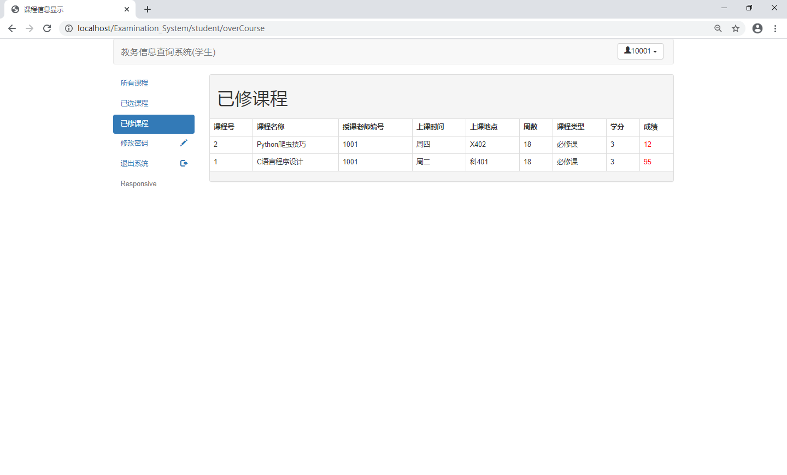
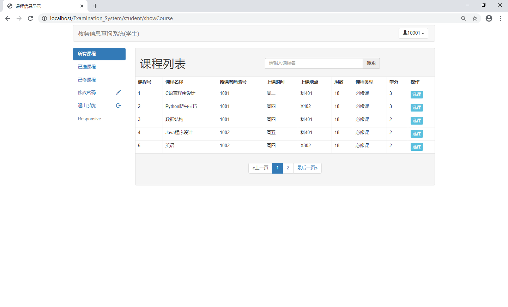

这是个基于SSM+Bootstrap的教务查询系统，是一个简单的教务查询系统.

CSDN博客地址：https://blog.csdn.net/m0_47220500/article/details/125134977

B站运行视频：https://www.bilibili.com/video/BV1FZ4y1t7tc

项目下载地址：http://shiyuncode.com/details?id=12

IOC容器：Spring 框架：SpringMVC 
ORM框架：Mybatis 
数据源：C3P0 
日志：log4j 
前端框架：Bootstrap 
运行环境 jdk+tomcat+mysql+idea(eclipse)+maven 
项目技术： spring+spring mvc+mybatis+bootstrap+jquery 

本系统分为三种权限： 
1.管理员：可以管理所有学生和教师的基本信息等等 
2.教师：可以管理所有学生等等 
3.学生：查看各种自己的信息以及对应课程等等 

运行截图：

管理员：

教师：

学生：

